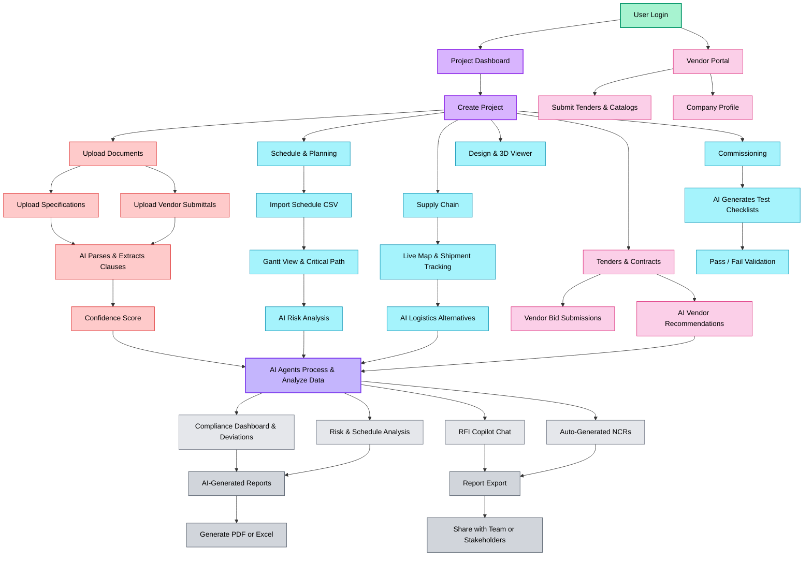
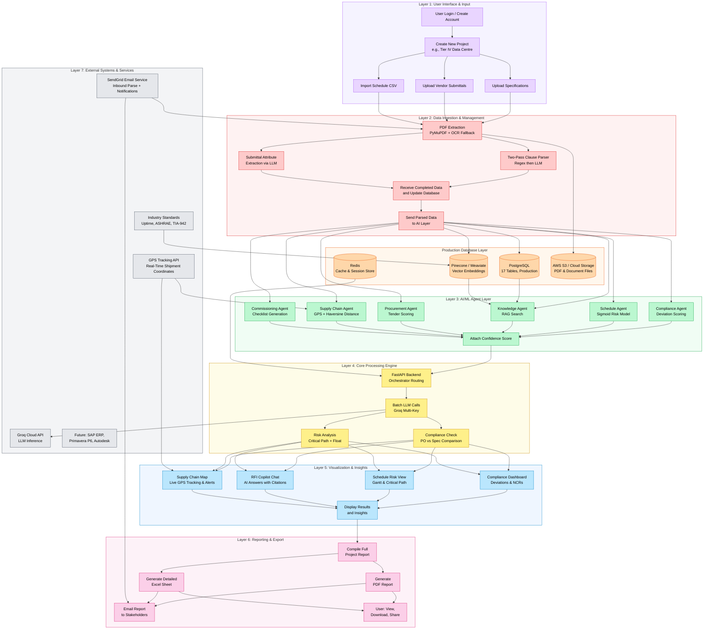
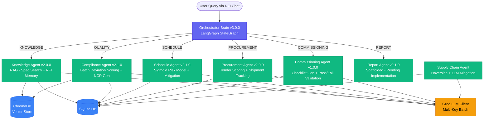
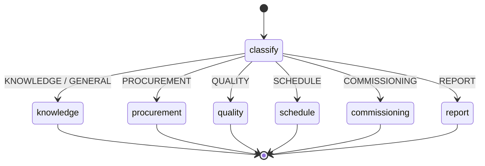
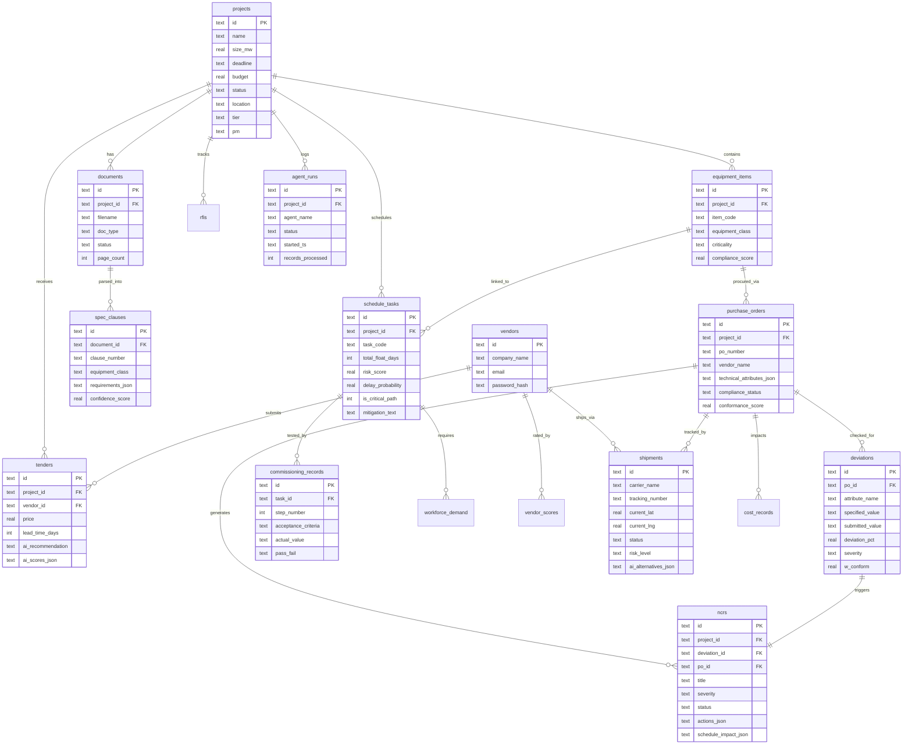
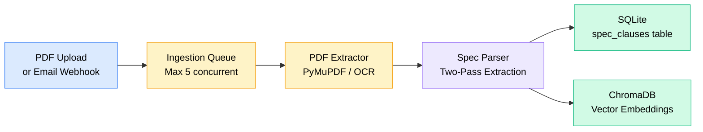
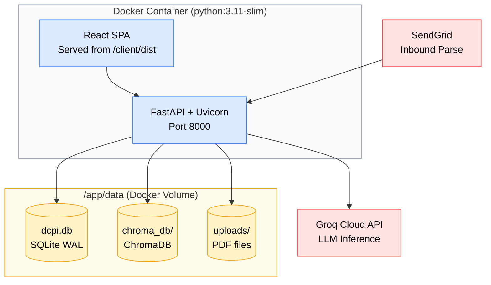

# DataForge AI — Architecture & Agent Workflow

> **DCPI (Data Centre Project Intelligence)** — AI-powered EPC project intelligence
> for Tier IV data centre construction. This document describes the **actual implemented**
> architecture, agent workflows, data flows, and system topology as found in the codebase.

---

## Table of Contents

1. [System Overview](#1-system-overview)
2. [Technology Stack](#2-technology-stack)
3. [Functional Flowchart (Mind Map)](#3-functional-flowchart-mind-map)
4. [Layered Architecture (7 Layers)](#4-layered-architecture-7-layers)
5. [Agent Architecture](#5-agent-architecture)
6. [Orchestrator Agent — LangGraph State Machine](#6-orchestrator-agent--langgraph-state-machine)
7. [Agent Detail Cards](#7-agent-detail-cards)
8. [Data Model (Entity Relationship)](#8-data-model-entity-relationship)
9. [Document Ingestion Pipeline](#9-document-ingestion-pipeline)
10. [API Surface](#10-api-surface)
11. [Client Application Pages](#11-client-application-pages)
12. [Deployment Architecture](#12-deployment-architecture)
13. [Key Design Decisions](#13-key-design-decisions)

---

## 1. System Overview

DataForge AI is an end-to-end AI-powered platform for managing Tier IV data centre EPC projects. It breaks down silos between documentation, schedules, supply chains, and quality control by deploying a multi-agent AI system orchestrated via LangGraph.

**Core Capabilities:**
- Upload and parse 1000+ page technical specifications with clause-level extraction
- Automated compliance checking of vendor submittals against spec requirements
- AI-powered schedule risk analysis with critical path identification
- Live supply chain tracking with Haversine distance-based delay prediction
- RAG-powered RFI chat that searches specs, past RFIs, and industry standards
- Commissioning checklist generation with automated pass/fail validation
- Vendor tender evaluation and AI-scored procurement recommendations
- Email webhook ingestion — forward docs to a project-specific address for auto-processing

---

## 2. Technology Stack

| Layer | Technology |
|---|---|
| **Frontend** | React 18, Vite, Tailwind CSS, Framer Motion, React Router v6 |
| **3D / Maps** | React Three Fiber, Three.js, React-Leaflet, Leaflet |
| **Backend** | FastAPI (Python 3.11+), Uvicorn, CORS middleware |
| **Database** | SQLite (WAL mode, 64 MB page cache, foreign keys ON) |
| **Vector Store** | ChromaDB (persistent, `all-MiniLM-L6-v2` embeddings via sentence-transformers) |
| **LLM Provider** | Groq API (primary, multi-key round-robin, concurrent batch calls) |
| **LLM Models** | `llama-3.1-8b-instant` (primary), `llama-3.2-3b-preview`, `mixtral-8x7b-32768` (fallbacks) |
| **Agent Framework** | LangGraph `StateGraph` for orchestrator routing |
| **PDF Extraction** | PyMuPDF (native), OCR fallback via pytesseract + pdf2image |
| **Auth** | JWT (python-jose), bcrypt password hashing (passlib) |
| **Containerisation** | Multi-stage Docker (Node 20 Alpine → Python 3.11 slim) |

---

## 3. Functional Flowchart (Mind Map)

*High-level user journey through the DataForge AI platform — from login to insights and reporting.*



---

## 4. Layered Architecture (7 Layers)

*Simplified architecture showing how data flows through the DataForge AI platform — from user input to final reports.*



---

## 5. Agent Architecture

The system implements **7 specialized agents** coordinated by a central **Orchestrator** built on LangGraph's `StateGraph`:



### Agent Summary Table

| Agent | Version | File | Key Function | LLM Usage |
|---|---|---|---|---|
| **Orchestrator Brain** | 3.0.0 | `orchestrator_agent.py` | Intent classification → route to specialist | `call_claude_json` for intent classification |
| **Knowledge & Document** | 2.0.0 | `knowledge_agent.py` | RAG search across specs, RFIs, standards, doc memory | `call_claude` for answer synthesis |
| **Compliance & Quality** | 2.1.0 | `compliance_agent.py` | PO vs spec comparison, deviation scoring, NCR generation | `call_claude_json_batch` (severity) + `call_claude_batch` (NCR text) |
| **Schedule & Risk** | 2.1.0 | `schedule_agent.py` | Float/NCR/predecessor/weather risk scoring, mitigation | `call_claude_batch` for mitigation plans |
| **Procurement & ERP** | 2.0.0 | `procurement_agent.py` | Tender analysis, bid scoring, shipment tracking | `call_claude_json` for bid recommendations |
| **Supply Chain** | — | `supply_chain_agent.py` | Haversine distance, delay math, logistics alternatives | `call_claude` for alternative strategies |
| **Commissioning Copilot** | 1.0.0 | `commissioning_agent.py` | Checklist generation from specs, test result validation | `call_claude_json` for dynamic checklist |
| **Report / Dashboard** | 0.1.0 | `report_agent.py` | Scaffolded — returns mock data | None (not yet implemented) |

---

## 6. Orchestrator Agent — LangGraph State Machine

The orchestrator is a compiled `StateGraph` that classifies user intent and routes to the correct specialist node. Each node runs synchronously and returns to `END`.



**State Shape (`OrchestratorState`):**

| Field | Type | Description |
|---|---|---|
| `query` | `str` | User's natural language query |
| `context` | `Dict` | Additional context (project_id, po_id, etc.) |
| `intent` | `str` | Classified intent (KNOWLEDGE, PROCUREMENT, etc.) |
| `extracted_parameters` | `Dict` | LLM-extracted params (po_id, task_id, event_details) |
| `agent_response` | `Dict` | Response payload from the specialist agent |
| `agent_run_id` | `str` | UUID for audit trail in `agent_runs` table |

**Fallback Behaviour:** When no LLM provider is available, the orchestrator uses keyword-based intent classification (e.g., "tender" → PROCUREMENT, "schedule" → SCHEDULE).

---

## 7. Agent Detail Cards

### 7.1 Compliance Agent (v2.1.0)

The most complex agent. Performs a full spec compliance check for a given Purchase Order:

```
Input: po_id (Purchase Order ID)
    │
    ▼
┌───────────────────────────────────┐
│ 1. Load PO technical attributes   │
│    from purchase_orders table     │
│ 2. Normalize attribute keys via   │
│    ATTR_ALIASES (80+ mappings)    │
└───────────────┬───────────────────┘
                │
                ▼
┌───────────────────────────────────┐
│ 3. Load spec clauses:            │
│    Priority: ChromaDB vector     │
│    search → SQLite fallback      │
│ 4. Extract requirements_json     │
│    from each clause              │
└───────────────┬───────────────────┘
                │
                ▼
┌───────────────────────────────────┐
│ 5. compare_attributes()          │
│    - MIN / MAX / EXACT tolerance │
│    - String mismatch detection   │
│    - MISSING mandatory checks    │
│    - Deviation % calculation     │
└───────────────┬───────────────────┘
                │
                ▼
┌───────────────────────────────────┐
│ 6. BATCH severity scoring        │
│    All deviations → one LLM call │
│    Fallback: heuristic thresholds│
│    (>15% CRITICAL, >10% MAJOR,   │
│     >5% MINOR, else OBSERVATION) │
└───────────────┬───────────────────┘
                │
                ▼
┌───────────────────────────────────┐
│ 7. BATCH NCR generation          │
│    CRITICAL + MAJOR + MINOR devs │
│    → concurrent LLM call for NCR │
│    text (TITLE/DESC/IMPACT/ACTS) │
│ 8. Save NCRs + schedule impact   │
│ 9. Update PO compliance_status   │
└───────────────────────────────────┘
```

**Severity Thresholds (configurable via env):**
- `CRITICAL`: ≥ 15% deviation
- `MAJOR`: ≥ 10% deviation
- `MINOR`: ≥ 5% deviation
- `OBSERVATION`: < 5% deviation

---

### 7.2 Schedule Agent (v2.1.0)

Multi-factor risk scoring using a sigmoid probability model:

**Risk Factors:**
1. **Float Erosion** — tasks with ≤ 0 float days score highest
2. **NCR Procurement Impact** — linked NCRs add delay (CRITICAL=14d, MAJOR=7d, MINOR=2d)
3. **Predecessor Chain** — cascade risk from upstream delays
4. **Historical Average Delay** — exponential weighting on past performance
5. **Weather / External** — mock weather data integration

**Sigmoid Delay Probability:**
```
P(delay) = 1 / (1 + e^(-k * (risk_score - θ)))
where k=7.0, θ=0.45
```

**Risk Levels:**
- `>= 0.70` → HIGH (triggers AI mitigation generation)
- `>= 0.50` → MEDIUM
- `< 0.50` → LOW / NEGLIGIBLE

**Mitigation:** For high-risk tasks, generates 3 options (conservative → aggressive) via batch LLM call.

---

### 7.3 Supply Chain Agent

Deterministic mathematical engine with LLM-powered mitigation:

1. **Haversine Distance** — calculates remaining miles from current GPS to destination
2. **Delay Calculation** — `remaining_distance / 50mph` vs hours until required delivery
3. **Critical Path Cross-Reference** — checks if linked schedule task has zero float
4. **Risk Score** (0–100) with weighted components:
   - Delay severity: +15 to +40 points
   - Critical path: +20 to +35 points
5. **LLM Trigger** — only calls LLM when risk ≥ 45 (HIGH/CRITICAL)
6. **Output** — alternative logistics strategies (air freight, local sourcing, etc.)

---

### 7.4 Knowledge Agent (v2.0.0)

RAG-powered query engine with multi-source retrieval:

**Search Sources:**
1. `spec_clauses` collection (ChromaDB) — project specifications
2. `rfis` collection (ChromaDB) — past RFI resolutions
3. `industry_standards` collection — Uptime Institute, ASHRAE, TIA-942
4. `document_memory` collection — ingested PDF memory

**Pipeline:** Query → embed → vector search (top-k) → rank sources → synthesize answer via LLM with citations

---

### 7.5 Commissioning Agent (v1.0.0)

Generates equipment-specific testing checklists:

**Step Templates (built-in):** UPS (10 steps), PDU (7 steps), COOLING (multi-step), GENERATOR, SWITCHGEAR

**Workflow:**
1. Identify commissioning tasks from `schedule_tasks` via keyword matching
2. Look up equipment class from linked `equipment_items`
3. Generate checklist from built-in templates + LLM-enhanced criteria from specs
4. Validate test results against acceptance criteria
5. Auto-create NCRs for failed steps

---

## 8. Data Model (Entity Relationship)



**Total Tables:** 17 (projects, documents, spec_clauses, equipment_items, purchase_orders, deviations, ncrs, schedule_tasks, commissioning_records, rfis, agent_runs, vendors, tenders, cost_records, vendor_scores, workforce_demand, reports, shipments)

---

## 9. Document Ingestion Pipeline



**Two-Pass Extraction:**
1. **Fast Heuristic Pass** — regex-based clause boundary detection, equipment class identification
2. **LLM Pass** — only for ambiguous clauses, extracts structured `requirements_json` with attributes, values, tolerances, and mandatory flags

**Ingestion Queue Features:**
- In-memory job tracking (queued → processing → done | failed)
- Max concurrent jobs: 5 (configurable via `INGEST_MAX_CONCURRENT`)
- DB status column updated for frontend polling
- Background async worker thread

---

## 10. API Surface

All endpoints are registered under `/api/` with the following router structure:

| Router | Prefix | Key Endpoints | Agent(s) Triggered |
|---|---|---|---|
| **Upload** | `/api/upload` | `POST /spec`, `POST /submittal`, `POST /schedule` | Spec Parser, Ingestion Queue |
| **Auth** | `/api/auth` | `POST /login`, `POST /register`, `POST /vendor/register` | — |
| **Projects** | `/api/projects` | `GET /`, `POST /`, `GET /{id}` | — |
| **Tenders** | `/api/tenders` | `GET /`, `POST /`, `POST /recommend` | Procurement Agent |
| **Compliance** | `/api/compliance` | `POST /check/{po_id}`, `GET /ncrs`, `GET /ncrs/{id}` | Compliance Agent |
| **Schedule** | `/api/schedule` | `GET /tasks`, `POST /analyze`, `POST /upload` | Schedule Agent |
| **RFI** | `/api/rfi` | `POST /query`, `GET /history` | Orchestrator → Knowledge Agent |
| **Dashboard** | `/api/dashboard` | `GET /summary`, `GET /metrics` | — (aggregation queries) |
| **Commissioning** | `/api/commissioning` | `GET /tasks`, `POST /generate/{task_id}`, `POST /validate` | Commissioning Agent |
| **Supply Chain** | `/api/supply-chain` | `GET /shipments`, `POST /analyze/{id}` | Supply Chain Agent |
| **Webhooks** | `/api/webhooks` | `POST /inbound-email` | Ingestion Queue (auto-parse) |
| **Design** | `/api/design` | `POST /analyze-floorplan` | — |
| **Integrations** | `/api/integrations` | `POST /upload-standard`, `GET /standards` | Vector Store indexing |
| **Health** | `/api/`, `/health`, `/api/status` | Health check, route listing | — |

---

## 11. Client Application Pages

| Page | Route | Description |
|---|---|---|
| Landing Page | `/` (unauthenticated) | Marketing / product overview |
| Login / Signup | `/login`, `/signup` | JWT authentication + vendor registration |
| Projects | `/projects` | Project list with create/select |
| New Project | `/projects/new` | Create project (name, location, MW, budget, tier) |
| Dashboard | `/dashboard` | KPI cards, charts, recent agent activity |
| Documents | `/documents` | Upload specs/submittals, view parsed clauses |
| Compliance | `/compliance` | Run compliance checks, view deviations |
| NCR Detail | `/ncr/:ncrId` | Individual NCR with actions and spec references |
| Schedule | `/schedule` | Gantt-style view, risk analysis, critical path |
| RFI Chat | `/rfi` | AI chat interface with citations |
| Tenders | `/tenders` | Vendor bid comparison, AI recommendations |
| Supply Chain | `/supply-chain` | Live map with shipment tracking |
| Commissioning | `/commissioning` | Test checklists, pass/fail entry |
| Design | `/design` | 2D → 3D floor plan viewer |
| Integrations | `/integrations` | Upload industry standards (Uptime, ASHRAE) |
| Settings | `/settings` | App configuration |
| Team | `/team` | Team member management |

**Vendor Portal (separate routes for `user.type === "vendor"`):**
- `/` → Vendor Dashboard
- `/vendor/tenders` → Submit and track tenders
- `/vendor/profile` → Company profile

---

## 12. Deployment Architecture



**Build Stages:**
1. `frontend-builder` (Node 20 Alpine) — `npm ci && npm run build`
2. Final image (Python 3.11 slim) — installs pip deps, copies server + compiled frontend
3. Single container serves both API and SPA via catch-all route

---

## 13. Key Design Decisions

| Decision | Rationale |
|---|---|
| **Groq over OpenAI/Anthropic** | Fastest inference speed for batch operations; multi-key rotation avoids rate limits |
| **SQLite WAL mode** | Single-file deployment, concurrent read/write, 64 MB page cache for performance |
| **ChromaDB (local)** | Zero-infra vector store that persists to disk; `all-MiniLM-L6-v2` for fast embeddings |
| **Batch LLM calls** | Compliance agent sends all deviations in one batch instead of N sequential calls |
| **Heuristic fallbacks** | Every agent works without an LLM — keyword classification, threshold-based scoring |
| **LangGraph orchestrator** | Compiled `StateGraph` with conditional edges for deterministic routing |
| **Two-pass PDF parsing** | Fast regex heuristics first, LLM only for ambiguous clauses — saves tokens |
| **Attribute aliasing** | 80+ alias mappings normalize vendor attribute names to canonical keys |
| **JWT auth** | Stateless auth with separate vendor/engineer roles |
| **In-memory ingestion queue** | Lightweight async job tracking; max 5 concurrent to avoid LLM throttling |
| **Docker single container** | Simplified deployment — API serves React SPA via catch-all route |
    