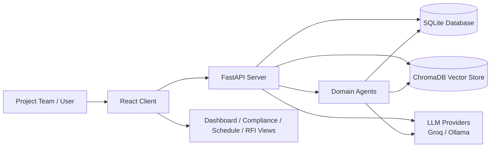
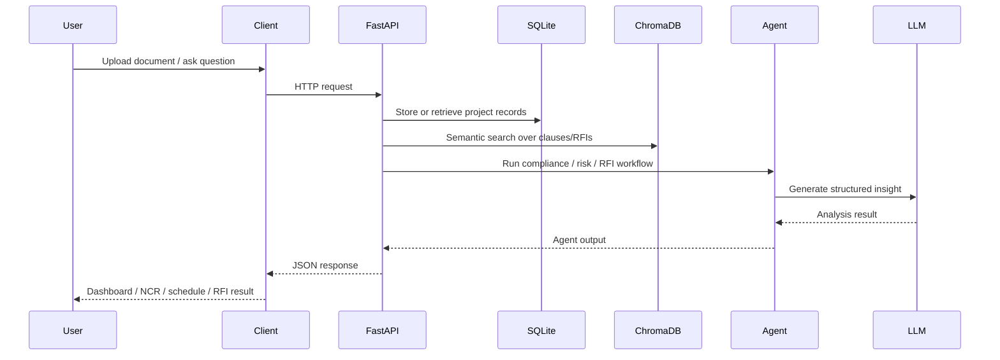
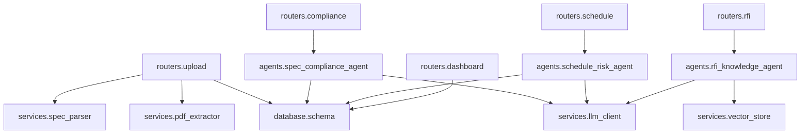
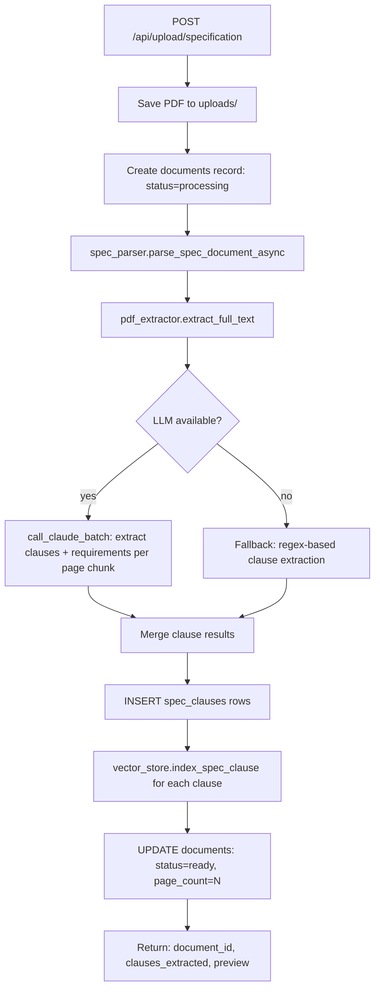
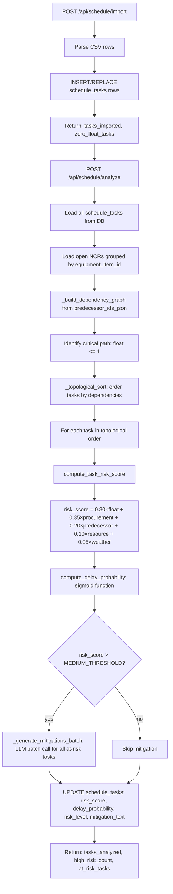
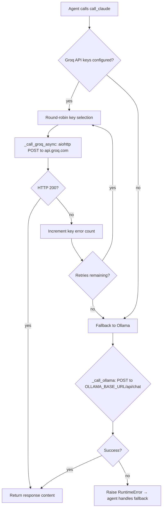
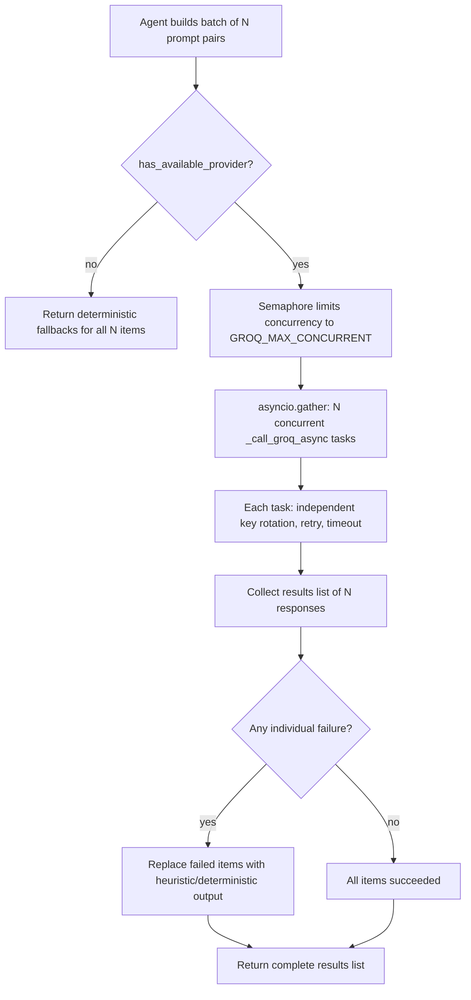
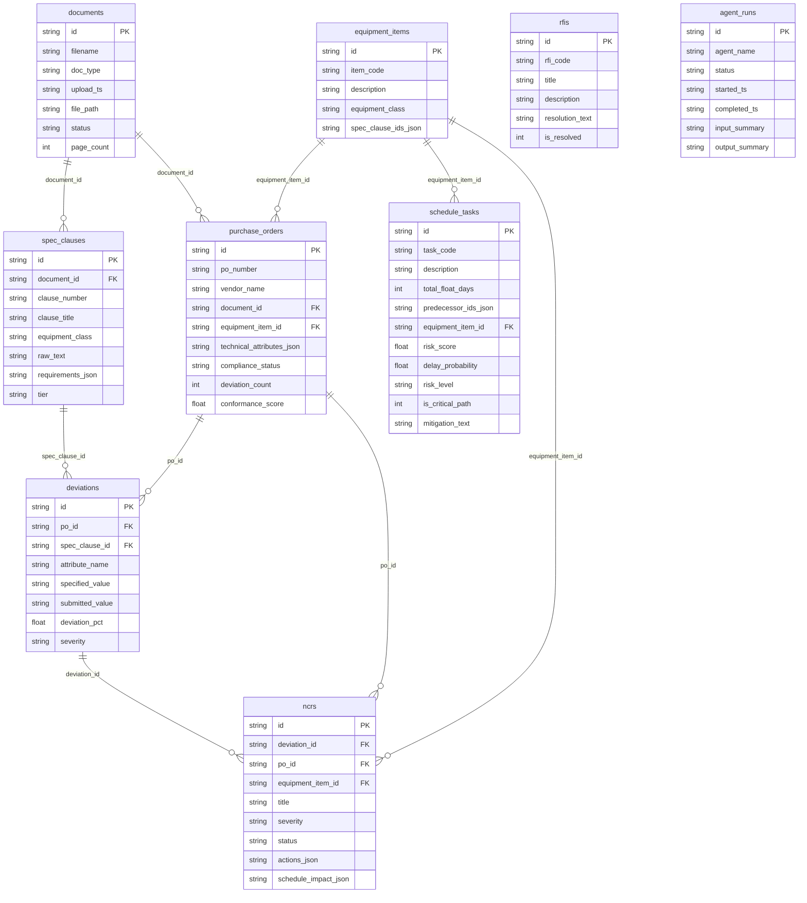

# DCPI Project Overview and Architecture

DCPI is an AI-powered project intelligence platform for data centre EPC delivery. It combines document ingestion, compliance intelligence, schedule risk analysis, and RFI assistance into a single operational workspace. The system is designed to help project teams review technical submittals, track non-conformance issues, assess schedule exposure, and retrieve answers from project documentation using retrieval-augmented generation.

## 1. Product Purpose

The application supports four main operational workflows:

- Compliance management: compare vendor submittals against specification clauses and generate NCRs.
- Schedule risk analysis: evaluate construction tasks for delay probability using float, predecessor dependencies, procurement impact, and NCR severity.
- RFI assistance: answer project questions using relevant specification clauses and prior resolved RFIs.
- Project monitoring: provide an executive view of project health, recent agent activity, and outstanding issues.

This project is intended for use during the engineering, procurement, and construction phases of hyperscale data centre delivery, where technical accuracy, speed of decision-making, and traceability are critical.

## 2. High-Level Architecture

The system follows a layered architecture:

- Client: a React + Vite SPA for dashboards, compliance workflows, schedule review, RFI chat, and settings.
- Server: a FastAPI service that hosts REST endpoints, orchestrates business logic, and interacts with the database and AI services.
- Persistence: SQLite stores project entities such as documents, clauses, POs, deviations, NCRs, schedule tasks, RFIs, and agent run logs.
- Vector intelligence: ChromaDB stores embedded specification clauses and RFIs for semantic search and retrieval.
- AI layer: LLM calls are centralized through a service that prefers Groq and falls back to Ollama when needed.

### Runtime Flow

1. A user uploads a specification or submittal document through the client.
2. The server saves the file, extracts text, parses clauses or technical attributes, and stores the results in SQLite.
3. The relevant information is indexed into ChromaDB for semantic retrieval.
4. Domain agents analyze the stored data and produce structured outputs such as deviations, NCRs, risk scores, or RFI answers.
5. The UI renders the results in dashboards, detail views, timeline components, and chat experiences.

## 3. Repository Structure

### Client

The client is located in the [client](client) directory.

Key areas:

- [client/src/App.jsx](client/src/App.jsx): defines the main route structure and app shell.
- [client/src/pages](client/src/pages): page-level experience for Dashboard, Compliance, NCRDetail, Schedule, RFIChat, SettingsPage, and ActivityCenter.
- [client/src/components](client/src/components): reusable UI modules including navigation, cards, loading states, animated backgrounds, and workflow-specific components.
- [client/src/context](client/src/context): authentication and workspace context providers.
- [client/src/api/client.js](client/src/api/client.js): central API client for server calls.

### Server

The server is located in the [server](server) directory.

Key areas:

- [server/main.py](server/main.py): FastAPI app configuration, startup lifecycle, router registration, middleware, and health endpoints.
- [server/routers](server/routers): HTTP endpoints for upload, compliance, schedule, RFI, and dashboard features.
- [server/agents](server/agents): domain agents responsible for orchestrating reasoning workflows.
- [server/services](server/services): shared services for LLM access, vector search, parsing, and PDF extraction.
- [server/database](server/database): SQLite schema and initialization logic.
- [server/models](server/models): Pydantic response models and shared request/response schemas.

## 4. Client Architecture

The client is a single-page application with animated page transitions and a lightweight auth/workspace shell.

### Primary UI Areas

- Dashboard: executive overview of project health, counts, open issues, and recent runs.
- Compliance: review purchase orders, compliance checks, deviations, and NCRs.
- NCR detail: inspect one NCR with severity, linked spec clause, schedule impact, and actions.
- Schedule: import schedule data, view tasks, and review risk analysis results.
- RFI: chat-like assistant for asking project questions and reviewing answers with sources.
- Settings and Activity: user preferences and recent system activity.

### Important Client Patterns

- Page transitions are animated using Framer Motion.
- The app uses route-based views with a shared navigation bar.
- Authentication state is managed by context providers.
- The UI is designed to be visually rich and presentation-oriented, with cards, animated counters, and progress visuals.

## 5. Server Architecture

The server is centered around FastAPI and uses thin routers that delegate to agents and services.

### Request Flow Pattern

1. A router receives an HTTP request.
2. The router validates the input and calls an agent or service.
3. The agent uses database queries and/or vector search to gather context.
4. The AI service is invoked to generate structured output or analysis.
5. The router returns a JSON response consumed by the client.

### Main Server Services

- [server/services/llm_client.py](server/services/llm_client.py): centralized LLM integration.
  - Uses Groq as the primary provider.
  - Falls back to Ollama when Groq credentials are unavailable.
  - Supports single-call and batch inference.
  - Includes JSON parsing utilities and retry/error handling.

- [server/services/vector_store.py](server/services/vector_store.py): ChromaDB-backed semantic search.
  - Stores embeddings for specification clauses and RFIs.
  - Supports indexing and similarity search.
  - Handles metadata serialization and collection initialization.

- [server/services/pdf_extractor.py](server/services/pdf_extractor.py): extracts text from uploaded PDFs.

- [server/services/spec_parser.py](server/services/spec_parser.py): parses uploaded specifications into clause-level records.

## 6. Data Model and Persistence

The database layer is implemented with SQLite and initialized by [server/database/schema.py](server/database/schema.py).

### Core Tables

- documents: stores uploaded specification or submittal files and their status.
- spec_clauses: stores extracted specification clauses and their requirements.
- equipment_items: stores equipment catalogue items linked to specifications and schedule tasks.
- purchase_orders: stores vendor submittals and their extracted technical attributes.
- deviations: stores detected mismatches between required and submitted values.
- ncrs: stores formal non-conformance records generated from deviations.
- schedule_tasks: stores imported schedule activities with float, predecessors, and risk results.
- rfis: stores open or resolved RFIs and their resolution text.
- agent_runs: stores execution logs and summaries for each AI-driven workflow.

### Why SQLite Is Used

SQLite is appropriate for this hackathon-style project because it keeps setup simple and allows rapid iteration without managing a separate database service. The schema is lightweight but sufficient for storing the project’s operational data and audit trail.

## 7. Core Agents

The application’s intelligence is organized around three domain agents.

### 7.1 Spec Compliance Agent

Implemented in [server/agents/spec_compliance_agent.py](server/agents/spec_compliance_agent.py).

Responsibilities:

- Normalize technical attributes from purchase orders and vendor submittals.
- Compare submitted values with specification requirements.
- Detect deviations using tolerance rules and rule-based comparison logic.
- Score deviation severity using heuristics or LLM output.
- Generate NCRs and attach schedule impact context.

Workflow:

1. Retrieve a purchase order and its linked equipment item.
2. Load the relevant specification clauses.
3. Extract and normalize requirements.
4. Compare required vs submitted attributes.
5. Classify each deviation as CRITICAL, MAJOR, MINOR, or OBSERVATION.
6. Generate one or more NCR records and update compliance status.

This agent is the backbone of the compliance experience.

### 7.2 Schedule Risk Agent

Implemented in [server/agents/schedule_risk_agent.py](server/agents/schedule_risk_agent.py).

Responsibilities:

- Read imported schedule tasks from the database.
- Build a dependency graph from predecessor relationships.
- Evaluate each task’s float, procurement delay, predecessor risk, resource risk, and weather risk.
- Compute a risk score and delay probability.
- Highlight tasks that are at risk and generate mitigation options.

Important logic:

- Total float is a major risk factor.
- Procurement delays are derived from linked NCRs and their severity.
- Predecessor risk propagates through the critical path logic.
- The agent can generate mitigation advice using a batch LLM call for efficiency.

This agent powers the schedule analysis experience and the at-risk task recommendations.

### 7.3 RFI Knowledge Agent

Implemented in [server/agents/rfi_knowledge_agent.py](server/agents/rfi_knowledge_agent.py).

Responsibilities:

- Accept an RFI question from the user.
- Search the specification corpus and existing RFIs using semantic retrieval.
- Prefer resolved precedent RFIs when they match the current question.
- Build a grounded response using only the retrieved context.
- Return sources and a confidence score.

Workflow:

1. Query the vector store for relevant specification clauses.
2. Query the vector store for related RFIs.
3. Build a context block from the retrieved documents.
4. Ask the LLM to answer using only the provided evidence.
5. Return a structured response with sources and precedents.

This agent is the intelligence layer behind the RFI assistant experience.

## 8. API Surface

The server exposes a set of REST endpoints grouped by feature.

### Upload Routes

- POST /api/upload/specification: upload and parse a specification PDF.
- POST /api/upload/submittal: upload a vendor submittal PDF and create a purchase order record.

### Compliance Routes

- POST /api/compliance/run/{po_id}: run compliance checks for a PO.
- GET /api/compliance/results/{po_id}: retrieve deviations and results for a PO.
- GET /api/compliance/ncrs: list NCRs with severity/status filters.
- GET /api/compliance/ncr/{ncr_id}: retrieve a single NCR and its supporting detail.

### Schedule Routes

- POST /api/schedule/import: import a schedule CSV or text file.
- POST /api/schedule/analyze: run schedule risk analysis.
- GET /api/schedule/tasks: retrieve all imported tasks.
- GET /api/schedule/risks: retrieve at-risk schedule tasks.

### RFI Routes

- POST /api/rfi/query: answer an RFI question using the knowledge agent.
- GET /api/rfi/rfis: list stored RFIs.
- POST /api/rfi/rfis/create: create a new RFI record and index it.

### Dashboard Routes

- GET /api/dashboard/summary: retrieve health metrics, counts, recent agent runs, and purchase order snapshots.

## 9. AI and Retrieval Strategy

The platform uses both deterministic logic and large-language-model reasoning.

### Deterministic Logic

- Rule-based comparison for compliance checks.
- Float-based and dependency-based risk scoring for schedule analysis.
- Metadata-based filtering and relevance ranking for retrieved evidence.

### Generative AI

- LLMs are used to classify deviations, create NCR descriptions, generate mitigation actions, and answer RFI questions.
- The system prefers structured outputs and uses robust JSON parsing so the server can safely consume model responses.
- The architecture is designed to work even when the LLM provider is unavailable by falling back to deterministic or heuristic responses.

## 10. Architecture Diagrams

### 10.1 High-Level System Architecture



### 10.2 Document-to-Insight Flow



### 10.3 Core Module Relationships



## 11. Architecture Flows

### 11.1 Application Startup Flow

```mermaid
flowchart TD
    START([uvicorn main:app]) --> A[FastAPI lifespan: startup]
    A --> B[Create uploads/ and chroma_db/ directories]
    B --> C[init_db → create tables and indexes]
    C --> D[Initialize ChromaDB collections]
    D --> E[Register API routers]
    E --> F{Mount static files}
    F -->|success| G[Validate environment variables]
    F -->|failure| G
    G --> H[Server ready on :8000]
    H --> I[/health endpoint available]
    H --> J[/docs Swagger UI available]
    H --> K[/api/ routes active]
```

### 11.2 Specification Upload and Ingestion Pipeline



### 11.3 Submittal Upload and Compliance Check Flow

```mermaid
flowchart TD
    A[POST /api/upload/submittal] --> B[Save PDF, create documents record]
    B --> C[extract_full_text from PDF]
    C --> D[LLM: extract technical_attributes_json]
    D --> E[INSERT purchase_orders record]
    E --> F[Return: po_id, document_id, attributes]

    F --> G[POST /api/compliance/run/{po_id}]
    G --> H[Load PO + equipment_item + spec_clauses]
    H --> I[normalize_attributes: resolve aliases, snake_case]
    I --> J[_extract_requirements: parse requirements_json from clauses]
    J --> K[compare_attributes: tolerance-based matching]
    K --> L{Deviations found?}
    L -->|yes| M[_score_deviations_batch: LLM severity classification]
    L -->|no| N[status = COMPLIANT]
    M --> O[INSERT deviations rows]
    O --> P[_generate_ncrs_batch: LLM NCR text generation]
    P --> Q[INSERT ncrs rows with schedule_impact]
    Q --> R[_calculate_conformance_score]
    R --> S[UPDATE purchase_orders: compliance_status, conformance_score]
    S --> T[Return: deviations, ncrs, summary]
```

### 11.4 Schedule Import and Risk Analysis Flow



### 11.5 RFI Query RAG Flow

```mermaid
flowchart TD
    A[POST /api/rfi/query] --> B{ChromaDB available?}
    B -->|yes| C[search_spec_clauses: vector similarity]
    B -->|no| D[_fallback_spec_search: keyword match in SQLite]
    C --> E{ChromaDB available?}
    D --> E
    E -->|yes| F[search_rfis: vector similarity]
    E -->|no| G[_fallback_rfi_search: keyword match in SQLite]
    F --> H[_build_source_list: merge + sort by score]
    G --> H
    H --> I{Any results?}
    I -->|no| J[Return: "No relevant documents found. Recommend formal RFI."]
    I -->|yes| K[_find_precedent_rfis: filter resolved RFIs above PRECEDENT_THRESHOLD]
    K --> L[_build_context_text: format SOURCE blocks]
    L --> M[_build_precedent_text: format precedent RFI summary]
    M --> N{LLM available?}
    N -->|yes| O[call_claude: RAG prompt with context + precedents + query]
    N -->|no| P[_fallback_answer: deterministic text from top sources]
    O --> Q[_compute_confidence: top_score + source_boost + precedent_boost]
    P --> Q
    Q --> R[_log_agent_run to agent_runs table]
    R --> S[Return: answer, sources, precedent_rfis, confidence]
```

### 11.6 LLM Provider Resolution and Fallback Flow



### 11.7 Batch LLM Concurrency Model



### 11.8 Client Component and Data Flow

```mermaid
flowchart TD
    subgraph App Shell
        A[App.jsx → BrowserRouter]
        B[AuthProvider → AuthContext]
        C[WorkspaceProvider → WorkspaceContext]
        D[Navbar.jsx]
        E[NotificationDrawer.jsx]
    end

    subgraph Pages
        F[Dashboard.jsx]
        G[Compliance.jsx]
        H[NCRDetail.jsx]
        I[Schedule.jsx]
        J[RFIChat.jsx]
        K[SettingsPage.jsx]
        L[ActivityCenter.jsx]
    end

    subgraph API Layer
        M[api/client.js → fetch wrapper]
    end

    subgraph Server
        N[/api/dashboard/summary]
        O[/api/compliance/**]
        P[/api/schedule/**]
        Q[/api/rfi/**]
    end

    A --> B
    A --> C
    A --> D
    A --> E
    D --> F
    D --> G
    D --> I
    D --> J
    G --> H

    F --> M --> N
    G --> M --> O
    H --> M --> O
    I --> M --> P
    J --> M --> Q
```

### 11.9 Database Entity Relationship Diagram



## 12. Folder and File Structure

### Top-Level Structure

```text
ET_hackathon_v2/
├── overview.md
├── README.md
├── server/
├── docs/
├── client/
```

### Server Structure

```text
server/
├── main.py
├── requirements.txt
├── seed_data.py
├── test_groq_api.py
├── agents/
│   ├── __init__.py
│   ├── rfi_knowledge_agent.py
│   ├── schedule_risk_agent.py
│   └── spec_compliance_agent.py
├── database/
│   ├── __init__.py
│   ├── connection.py
│   ├── migrate_add_columns.py
│   └── schema.py
├── models/
│   ├── __init__.py
│   └── schemas.py
├── routers/
│   ├── __init__.py
│   ├── compliance.py
│   ├── dashboard.py
│   ├── rfi.py
│   ├── schedule.py
│   └── upload.py
├── services/
│   ├── __init__.py
│   ├── llm_client.py
│   ├── pdf_extractor.py
│   ├── spec_parser.py
│   └── vector_store.py
├── uploads/
└── chroma_db/
```

### Client Structure

```text
client/
├── index.html
├── package.json
├── postcss.config.js
├── tailwind.config.js
├── vite.config.js
├── public/
└── src/
    ├── App.jsx
    ├── index.css
    ├── main.jsx
    ├── api/
    ├── components/
    ├── context/
    └── pages/
```

## 13. Operational Notes

### Environment Variables

The server uses environment variables for configuration, including:

- GROQ_API_KEYS or GROQ_API_KEY
- GROQ_MODEL
- OLLAMA_BASE_URL and OLLAMA_MODEL
- CHROMA_PATH
- EMBEDDING_MODEL
- UPLOADS_PATH
- CORS_ORIGINS

### Startup Lifecycle

On startup, the application:

- creates the uploads and ChromaDB directories,
- initializes the SQLite database,
- initializes ChromaDB collections,
- registers the API routers,
- mounts uploaded files as static assets.

### Health and Diagnostics

The server exposes health endpoints that verify the database and vector store availability. Agent runs are logged for auditability and later inspection.

## 14. Development and Extension Points

The project is organized so new capabilities can be added cleanly.

To extend the system:

- add a new router for a new feature,
- implement orchestration logic in a new agent under [server/agents](server/agents),
- reuse [server/services/llm_client.py](server/services/llm_client.py) and [server/services/vector_store.py](server/services/vector_store.py) for AI and retrieval capabilities,
- update the database schema in [server/database/schema.py](server/database/schema.py) if new entities are required.

## 15. Summary

DCPI is a practical AI-enabled construction intelligence platform that connects document processing, compliance review, schedule analysis, and RFI support into one coherent workflow. Its architecture is intentionally modular: the client renders workflows, the server orchestrates data and logic, and the agents provide domain-specific intelligence grounded in project data and documentation.

